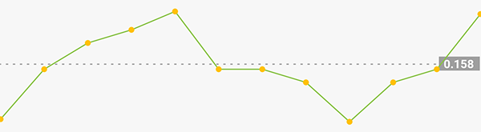
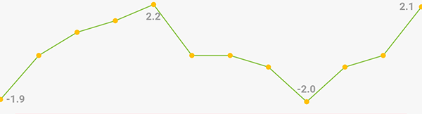
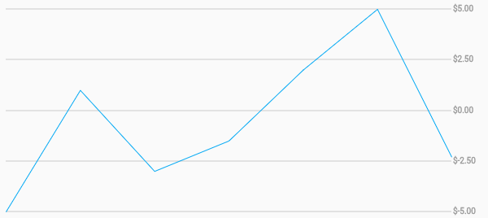

[](https://pub.dev/packages/chart_sparkline)

# chart_sparkline

Beautiful sparkline charts for Flutter.


## Installation

Install the latest version [from pub](https://pub.dev/packages/chart_sparkline/install).

## Quick Start

Import the package, create a `Sparkline` , and pass it your data.

```dart
import 'package:flutter/material.dart';
import 'package:chart_sparkline/chart_sparkline.dart';

void main() {
  var data = [0.0, 1.0, 1.5, 2.0, 0.0, 0.0, -0.5, -1.0, -0.5, 0.0, 0.0];
  runApp(
    MaterialApp(
      home: Scaffold(
        body: Center(
          child: Container(
            width: 300.0,
            height: 100.0,
            child: Sparkline(
              data: data,
            ),
          ),
        ),
      ),
    ),
  );
}
```


## Customization

### Sparkline

| Property     | Default          |
|--------------|:----------------:|
| lineWidth    | 2.0              |
| lineColor    | Colors.lightBlue |
| lineGradient | null             |

Example:

```dart
Sparkline(
  data: data,
  lineWidth: 5.0,
  lineColor: Colors.purple,
);
```


```dart
Sparkline(
  data: data,
  lineWidth: 10.0,
  lineGradient: LinearGradient(
    begin: Alignment.topCenter,
    end: Alignment.bottomCenter,
    colors: [Colors.purple[800], Colors.purple[200]],
  ),
);
```


---

### Points

| Property   | Default               |
|------------|:---------------------:|
| pointsMode | PointsMode.none       |
| pointSize  | 4.0                   |
| pointColor | Colors.lightBlue[800] |
| pointIndex | null                  |

| PointsMode     | Description                                          |
|:--------------:|------------------------------------------------------|
| none (default) | Do not draw individual points.                       |
| all            | Draw all the points in the data set.                 |
| last           | Draw only the last point in the data set.            |
| atIndex        | Draw one point at the index specified by pointIndex. |

Example:

```dart
Sparkline(
  data: data,
  pointsMode: PointsMode.all,
  pointSize: 8.0,
  pointColor: Colors.amber,
);
```


```dart
Sparkline(
  data: data,
  pointsMode: PointsMode.last,
  pointSize: 8.0,
  pointColor: Colors.amber,
);
```


```dart
Sparkline(
  data: data,
  pointsMode: PointsMode.atIndex,
  pointIndex: 7,
  pointSize: 8.0,
  pointColor: Colors.amber,
);
```


---

### Fill

| Property     | Default               |
|--------------|:---------------------:|
| fillMode     | FillMode.none         |
| fillColor    | Colors.lightBlue[200] |
| fillGradient | null                  |

| FillMode       | Description                           |
|:--------------:|---------------------------------------|
| none (default) | Do not fill, draw only the sparkline. |
| above          | Fill the area above the sparkline.    |
| below          | Fill the area below the sparkline.    |

Example:

```dart
Sparkline(
  data: data,
  fillMode: FillMode.below,
  fillColor: Colors.red[200],
);
```


```dart
Sparkline(
  data: data,
  fillMode: FillMode.above,
  fillColor: Colors.red[200],
);
```


```dart
Sparkline(
  data: data,
  fillMode: FillMode.below,
  fillGradient: LinearGradient(
    begin: Alignment.topCenter,
    end: Alignment.bottomCenter,
    colors: [Colors.red[800], Colors.red[200]],
  ),
);
```


### Smoothing

```dart
Sparkline(
  data: data,
  useCubicSmoothing: true,
  cubicSmoothingFactor: 0.2,
),
```


### Average Line

```dart
Sparkline(
  data: data,
  averageLine: true,
  averageLabel: true,
),
```



### first, last, highest and the lowest 

```dart
Sparkline(
  data: data,
  kLine: ['max', 'min', 'first', 'last'],
),
```



### gridLine

```dart
Sparkline(
  gridLinelabelPrefix: '\$',
  gridLineLabelPrecision: 3,
  enableGridLines: true,
),
```



---

### Todo:

* [x] simple sparkline
* [x] custom line width
* [x] custom line color 
* [x] optional rounded corners
* [x] fill
* [x] embiggen individual points/change color
* [x] different points modes [all/last/none]
* [ ] animate between two sparklines
* [ ] animate drawing a single sparkline
* [ ] gesture detector to select closest point to tap
* [ ] baseline
* [x] different fill modes [above/below/none]
* [x] fix edge points overflowing by offsetting by lineWidth
* [x] better corner rounding
* [x] axis labels
* [x] gradient shader on line paint
* [x] gradient shader on fill paint
* [ ] multiple overlapping sparklines on a shared axis
* [ ] tests
